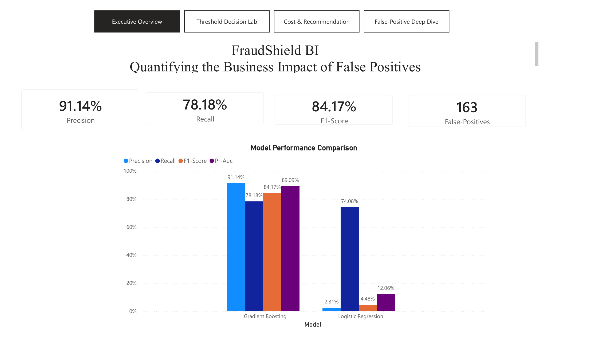

# FraudShield BI: Quantifying the Impact of False Positives

FraudShield BI is an MIS581 Business Intelligence and Data Analytics capstone project that evaluates credit-card fraud detection from both a **technical-performance** and **business-impact** perspective. The project compares class-weighted logistic regression with histogram-based gradient boosting, analyzes classification-threshold tradeoffs, estimates the cost of false positives and missed fraud, and presents the results in a four-page Power BI dashboard.

**Student:** Atta Febri-Yeboah  
**Course:** MIS581 — Capstone: Business Intelligence and Data Analytics  
**Institution:** Colorado State University Global  
**Instructor:** Dr. Jamia Mills  
**Completed:** July 2026

---

## Business Problem

Fraud controls must identify suspicious transactions without unnecessarily disrupting legitimate customers. A false positive occurs when a valid transaction is incorrectly flagged as fraud. These errors may cause declined purchases, added authentication, manual review, customer-service contacts, lost sales, and reduced customer trust.

FraudShield BI evaluates the balance among:

- fraud captured,
- legitimate transactions incorrectly flagged,
- manual-review workload,
- customer friction, and
- estimated business cost.

The objective is not simply to choose the model with the highest accuracy. It is to identify the model and threshold that provide the most appropriate balance between fraud prevention and operational impact.

---

## Research Questions

1. How does changing the fraud-classification threshold affect false-positive rate, fraud detection, review volume, and estimated cost?
2. Which transaction characteristics and model outputs are associated with false-positive decisions?
3. How can business-intelligence dashboards and cost scenarios help decision-makers compare fraud prevention with customer friction and operating cost?

All three null hypotheses were rejected based on the completed threshold, statistical, segmentation, and cost analyses.

---

## Dataset

The project uses the public **Credit Card Transactions Fraud Detection Dataset** from Kaggle, generated with the Sparkov simulation tool.

- Training records: **1,296,675**
- Testing records: **555,719**
- Fraudulent training transactions: **7,506**
- Training fraud rate: **0.5789%**
- Time period represented: **2019–2020**

The raw CSV files are intentionally excluded because they total approximately **478 MB**, and the training file exceeds GitHub's normal per-file size limit. Download and placement instructions are provided in [`data/README.md`](data/README.md).

Dataset source: https://www.kaggle.com/datasets/kartik2112/fraud-detection

---

## Methods and Tools

### Python

Python was used for data validation, feature engineering, exploratory analysis, statistical testing, model development, threshold analysis, false-positive segmentation, cost-scenario analysis, and export of dashboard-ready files.

Primary libraries:

- pandas
- NumPy
- scikit-learn
- SciPy
- Matplotlib

### Models

- Class-weighted logistic regression
- Histogram-based gradient boosting

### Evaluation

Because fraud represented less than 1% of the records, accuracy was not used alone. Evaluation included precision, recall, F1-score, ROC-AUC, precision-recall AUC, confusion matrices, false-positive and false-negative counts, review volume, and estimated total business cost.

### Power BI

Power BI was used to transform the validated Python outputs into an interactive decision-support dashboard.

---

## Key Results

At the default **0.50 threshold**, histogram-based gradient boosting substantially outperformed logistic regression.

| Metric | Logistic Regression | Gradient Boosting |
|---|---:|---:|
| Precision | 2.31% | 91.14% |
| Recall | 74.08% | 78.18% |
| F1-score | 4.48% | 84.17% |
| PR-AUC | 12.06% | 89.09% |
| False positives | 67,204 | 163 |
| False negatives | 556 | 468 |

Gradient boosting detected **88 more fraudulent transactions** while reducing false positives by **67,041** at the 0.50 threshold.

Under the **moderate-cost scenario**, the recommended decision was:

- **Model:** Gradient Boosting
- **Threshold:** 0.10
- **Estimated total cost:** $93,392.28
- **False positives:** 1,173
- **False negatives:** 258
- **Missed fraud amount:** $50,531.52

The threshold that minimized estimated cost was not necessarily the threshold with the highest F1-score or the fewest reviews. Threshold selection is therefore a business decision, not merely a technical default.

---

## False-Positive Findings

- Travel had the highest false-positive rate: **13.02%**
- Miscellaneous point-of-sale transactions: **7.22%**
- Mean false-positive transaction amount: **$640.94**
- Mean correctly approved legitimate amount: **$57.00**
- Transaction amount, category, and hour were significantly associated with false-positive status

These findings support the use of customer context, travel awareness, step-up authentication, and review pathways rather than immediate declines for every borderline transaction.

---

## Power BI Dashboard

The dashboard contains four pages:

1. **Executive Overview**
2. **Threshold Decision Lab**
3. **Cost & Recommendation**
4. **False-Positive Deep Dive**

The editable Power BI file, PDF export, and page previews are available in [`dashboard/`](dashboard/).



---

## Repository Structure

```text
fraudshield-bi-false-positive-tax/
├── README.md
├── requirements.txt
├── .gitignore
├── data/
│   └── README.md
├── notebooks/
│   ├── FraudShield_BI_Analysis.ipynb
│   └── README.md
├── outputs/
│   ├── tables/
│   │   └── validated analytical CSV exports
│   └── charts/
│       └── figures 1–9 from the analysis
├── dashboard/
│   ├── FraudShield_BI_Dashboard.pbix
│   ├── FraudShield_BI_Dashboard.pdf
│   ├── executive_overview.png
│   ├── threshold_decision_lab.png
│   ├── cost_and_recommendation.png
│   ├── false_positive_deep_dive.png
│   └── README.md
├── reports/
│   ├── AfebriYeboah_MIS581_Final_Research_Paper.docx
│   └── AfebriYeboah_MIS581_Final_Research_Paper.pdf
└── presentation/
    ├── FraudShield_BI_Module_8_Presentation.pptx
    ├── FraudShield_BI_Module_8_Presentation.pdf
    └── presentation_script.md
```

---

## Reproduce the Analysis

Clone or download the repository, then install the dependencies:

```bash
pip install -r requirements.txt
```

Download `fraudTrain.csv` and `fraudTest.csv` according to [`data/README.md`](data/README.md), place both files in `data/`, and open:

```text
notebooks/FraudShield_BI_Analysis.ipynb
```

The notebook uses relative paths and exports refreshed tables and figures into `outputs/tables/` and `outputs/charts/`.

---

## Project Deliverables

- **Analysis notebook:** complete Python workflow with saved results
- **Power BI dashboard:** editable `.pbix`, PDF export, and page previews
- **Validated outputs:** model, threshold, cost, segmentation, and hypothesis tables
- **Research paper:** Word and PDF versions
- **Module 8 presentation:** PowerPoint, PDF, and speaker script

---

## Limitations

- The dataset is simulated and may not reproduce every real-world fraud behavior.
- Direct customer-experience measures such as complaints, satisfaction, attrition, abandoned purchases, and call-center contacts were unavailable.
- Cost values are scenario assumptions rather than confidential institutional expenses.
- The eight-week academic timeline limited model expansion and hyperparameter tuning.
- The dashboard is a decision-support prototype, not a production fraud-decision system.

---

## Ethics and Privacy

This project uses simulated public data only. It does not contain employer data, internal fraud rules, real customer records, or confidential business information. Direct identifiers and high-cardinality fields were excluded from model training.

FraudShield BI is presented as a decision-support framework. Model outputs should be monitored for fairness, concept drift, customer impact, and unintended bias, and should not replace responsible human oversight.

---

## Author

**Atta Febri-Yeboah**  
Master of Science in Data Analytics  
Colorado State University Global
